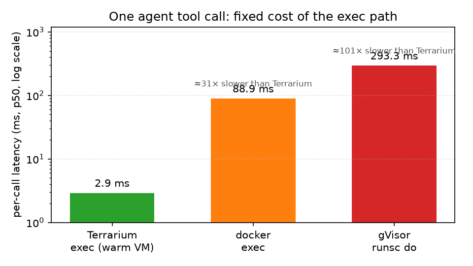
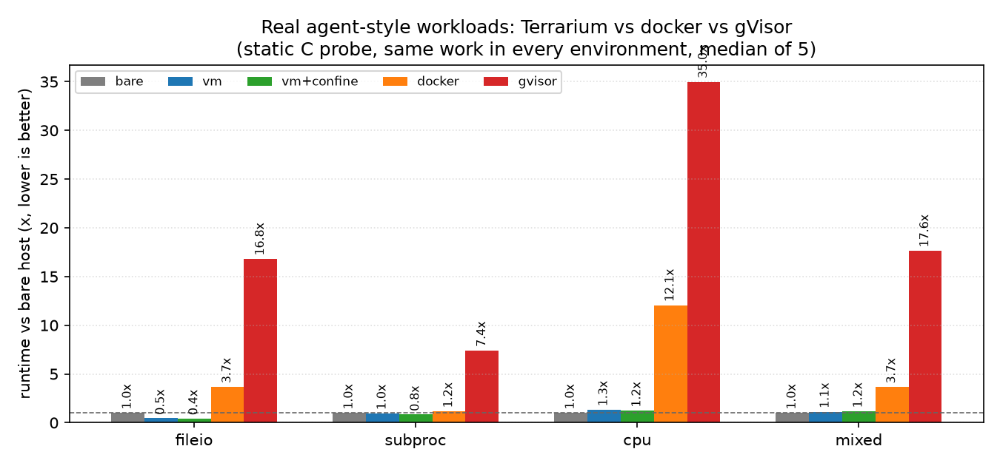
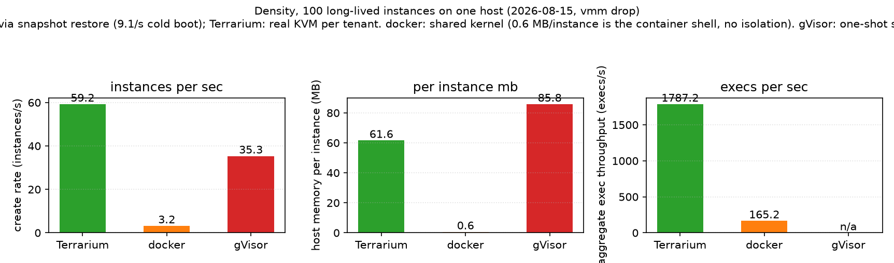
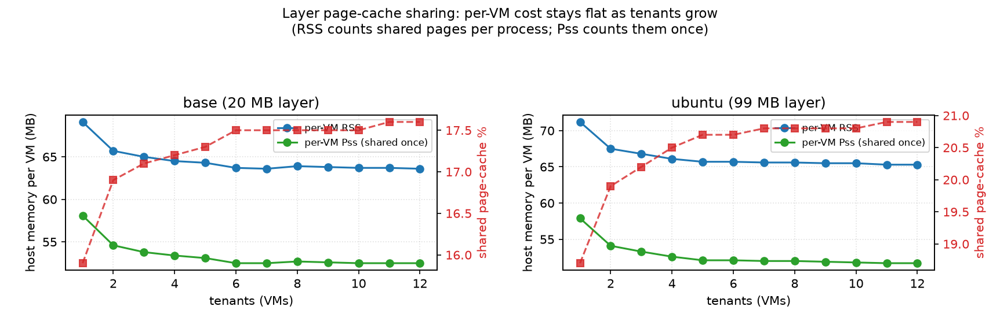

# Terrarium Engine

**Production-grade agent sandboxing — secure, isolated execution environments with high single-node density.**

Terrarium is a scheduling and control layer for agent execution environments. It pairs hardware-level VM isolation (Cloud Hypervisor) with a composable layered filesystem (EROFS + OverlayFS + virtiofs) and a warm pool, so untrusted agent code runs in real VMs that start in well under a second and share read-only environment layers across the host.

**Tenant-first model:** VMs are tenant isolation boundaries. A `Sandbox` is a session inside a VM, not a VM itself. Multiple sandboxes in the same tenant share one VM with isolated workdirs. This gives you both strong security isolation (between tenants) and high density (within a tenant).

## Why Terrarium

| | Container | MicroVM | Terrarium |
|---|---|---|---|
| Isolation | Shared kernel | KVM | **KVM + sandbox** |
| Density | High | Low | **High (shared page-cache layers)** |
| Provisioning | Fast | ~1s | **Warm pool (pre-booted VMs)** |
| Environments | OCI image | Disk image | **Composable named layers** |
| Backends | — | — | **CH microVMs + in-guest Sandlock (`SandboxAdapter` trait for future backends)** |

## Performance

Real measurements (same host, 2026-08-15; full methodology and raw data in
[docs/performance.md](docs/performance.md)):

| Agent-relevant metric | Terrarium | docker exec | gVisor runsc do |
|---|---:|---:|---:|
| One tool call (p50) | **~3 ms** | ~89 ms | ~293 ms |
| fileio workload (1500 files) | 15.5 ms | 136.3 ms | 619.9 ms |
| subproc workload (150 forks) | 122.2 ms | 172.2 ms | 1094.7 ms |
| mixed workload (write→build→read) | 37.5 ms | 117.1 ms | 564.7 ms |





Why it matters for agents: Terrarium VMs are long-lived and the agent
reuses a single vsock channel, so every tool call is one ~3 ms round trip.
docker exec pays a ~90 ms CLI/runc round trip per call, and gVisor's
one-shot `runsc do` pays ~300 ms of sandbox startup per call — over
thousands of calls per episode, that is the difference between training
throughput and timeouts.

Governance (the L2 in-guest sandbox, `terra-confine`) is **zero-cost on
real workloads** (0.87–1.04× across file/process/cpu/mixed loads): Landlock
is a static kernel verdict, seccomp only filters low-frequency network
syscalls, and cgroup is passive accounting. VM isolation is workload
dependent — ~1.3–2× on pure CPU, at parity on I/O and process-heavy agent
work. The host-side data planes (Cloud Hypervisor, virtiofsd) run under a
dedicated unprivileged user with no measurable cost on the exec path.





Density: 100 long-lived instances on one host — Terrarium restores
snapshots at **59.2 instances/s** (docker 3.2/s, gVisor empty shells
35.3/s), costs **61.6 MB host memory per real VM** (vs gVisor 85.8 MB),
and sustains **1787 execs/s** aggregate (vs docker 165/s). Cold boot of
a full VM is ~9/s — the snapshot restore path is the RL/density fast
create, and it beats gVisor even though gVisor provisions nothing.
Shared read-only layer page cache keeps per-VM cost flat as tenants grow
(~52 MB Pss at 12 VMs; a 99 MB layer adds only ~2 MB/VM). Warm-pool
claim ~9 ms; net restores at 539 VMs/s. Full detail in
[docs/performance.md](docs/performance.md) and
[docs/benchmarks.md](docs/benchmarks.md).

## Architecture

```
┌─ Host ──────────────────────────────────────────────────────┐
│  ┌──────────────────────────────────────────────────────┐   │
│  │                Terrarium Engine                       │   │
│  │     daemon · CLI · Python SDK · MCP Server            │   │
│  └──────────────────────┬───────────────────────────────┘   │
│          ┌──────────────┴──────────────┐                     │
│          ▼                             ▼                     │
│  ┌───────────────┐            ┌────────────────┐            │
│  │  CH Adapter   │            │ SandboxAdapter  │            │
│  │  (VmAdapter)  │            │    Sandlock     │          │
│  └───────┬───────┘            └───────┬────────┘            │
│          ▼                            ▼                      │
│  ┌─────────────────────────────────────────────┐            │
│  │       Cloud Hypervisor VM (per tenant)      │            │
│  │  ┌──────────┐ ┌──────────┐ ┌──────────┐    │            │
│  │  │ Sandbox  │ │ Sandbox  │ │ Sandbox  │    │            │
│  │  │ /workdir │ │ /workdir │ │ /workdir │    │            │
│  │  │ session  │ │ session  │ │ session  │    │            │
│  │  └──────────┘ └──────────┘ └──────────┘    │            │
│  │  guest-proxy (vsock relay, per VM)          │            │
│  │  virtiofs rootfs (shared layers + per-sb wd)│            │
│  └─────────────────────────────────────────────┘            │
└──────────────────────────────────────────────────────────────┘
```

The engine is decoupled from backends via two trait families:
`VmAdapter` (Cloud Hypervisor) and `SandboxAdapter` (Sandlock today;
the trait is kept as the extension point for future sandbox backends).

## Repository Structure

```
terrarium/
├── README.md / README_zh.md
├── LICENSE / NOTICE / THIRD-PARTY
├── crates/
│   ├── engine/               # Engine daemon: PyO3-backed lib with 7 command submodules
│   ├── adapter/
│   │   ├── traits/           # VmAdapter / SandboxAdapter traits, VmSpec, FsSpec, error types
│   │   ├── cloud-hypervisor/ # CH adapter (FS/VM decoupled), virtiofs, hotplug, network, landlock
│   │   ├── confine/          # Default SandboxAdapter (terra-confine backend)
│   │   └── sandlock/         # Alternative SandboxAdapter (sandlock backend)
│   ├── guest/
│   │   ├── proxy/            # In-guest command relay (vsock), backend argv translation
│   │   └── confine/          # In-guest limiter (terra-confine: Landlock/seccomp/cgroup)
│   ├── fs/                   # Independent filesystem crate: EROFS, cpio, layer build/list/remove (PyO3 bindings)
│   ├── protocol/             # Shared Command / Response types (single source of truth)
│   ├── network/              # Tap / NAT / dnsmasq DHCP, tc QoS
│   └── mcp/                  # MCP server (stdio JSON-RPC, 21 user-facing tools)
├── sdk/python/               # Python SDK (terra package: Sandbox, Pool, Template, client, daemon, assets, images)
├── images/                   # Guest kernel / rootfs / initramfs build scripts and examples
└── docs/                     # Index (docs/README.md), SDK/MCP/protocol, design,
                              # security, performance+benchmarks, paper, CI
```

## Quick Start

Install from the repository root:

```bash
pip install -e .
```

**Sandbox API** — the recommended high-level entry point (auto-starts daemon, context-manager cleanup):

```python
from terra.sandbox import Sandbox

# Sandbox = session inside a tenant VM (tenant-first model)
with Sandbox(tenant="my-org", template="alpine", network=True) as sb:
    result = sb.exec("echo hello")
    print(result.stdout)              # "hello\n"
    sb.files.write("/workdir/hello.txt", "Hello, Terrarium!")
    print(sb.files.read("/workdir/hello.txt"))
    print(sb.id)                      # "sb-a3f2b1c4" (engine-allocated id)
    print(sb.vm)                      # "tenant-my-org"

# Multiple sandboxes share one tenant VM
sb1 = Sandbox(tenant="research-team", template="alpine")
sb2 = Sandbox(tenant="research-team")   # reuses same VM, new workdir
sb3 = Sandbox(tenant="research-team")

sb1.kill()  # kills this session (running execs + workdir) — VM survives for siblings
Sandbox.destroy_tenant("research-team")  # destroys the VM and all sessions
```

**Warm pool** — pre-booted shared-tenant VMs, layers hot-plugged on claim:

```python
from terra.pool import Pool

pool = Pool(template="alpine", size=3)  # 3 pre-booted VMs
sb1 = pool.acquire()                   # Sandbox in a shared pool VM
sb2 = pool.acquire()                   # same VM, different workdir
print(sb1.exec(["uname", "-r"]).stdout)
pool.release(sb1)                      # back to idle
pool.release(sb2)
```

**CLI** — three steps to a running sandbox:

```bash
terra setup alpine                             # one-time: kernel + rootfs + initramfs + base layer (with confine) + template
terra daemon start                             # engine daemon (self-elevates via sudo; --no-root for rootless)
terra sandbox create --template alpine --net   # high-level sandbox (VM = tenant)
terra sandbox exec sb-xxxxxxxx -- echo hi      # sandboxed (confine) by default
terra sandbox kill sb-xxxxxxxx                 # kill the session (VM survives)
terra pool create -n mypool --size 3           # warm pool
terra pool claim --template alpine             # claim a ready sandbox
terra daemon status                            # engine state at a glance
```

`terra setup ubuntu` does the same for ubuntu. Tool layers (python3 and
friends) are built on a distro template:

`terra setup` also creates the dedicated `terra-vmm` system user: with the
daemon running as root, Cloud Hypervisor and virtiofsd drop to that
unprivileged user (tap fds are passed by the daemon; guest-visible root
ownership is preserved via virtiofsd uid translation), so a guest escape
into the host-side data planes no longer immediately means host root.
Skip it (legacy root mode) if the machine has no sudo during setup.

```bash
terra tool create -n python312 --template alpine --script images/examples/python312.sh
terra tool ls
terra tool remove -n python312
```

Tool layers are also the RL environment-baseline mechanism: bake the
environment's READY state into a layer (`images/examples/rl-env.sh`), then
`Batch.reset_in_place()` clears only the episode upper — the ready state
survives every reset. The minimal training loop is
`sdk/python/examples/rl_episode_loop.py` (inject input → run the layer
task → collect → reset_in_place); regression check in
`sdk/python/tests/manual_envlayer.sh`.

**Agent execution** — the same layer toolchain serves the agent use case:
repo + toolchain + tests baked into a layer, N agent environments restored
from one snapshot, each agent edits its workspace, and the in-place reset
returns every environment to the layer baseline. Proven end-to-end on a
real SWE-bench instance (`pallets__flask-4160`): bug reproduces at
baseline in 4 parallel envs, the fix turns the suite green (33 passed),
reset restores the broken baseline (`sdk/python/tests/manual_swebench.sh`).
The batch run extends this to 5 flask instances across versions
2.0/2.1/2.3 — all pass (`sdk/python/tests/manual_swebench_batch.py`,
raw results in `docs/benchmark-results-2026-08-05-swebench-batch.json`).

**Agent CI** — isolated verification of agent-written code, dogfooded on
this repo: `sdk/python/examples/ci_verify.py` restores a pristine
snapshot, copies the repo into the per-VM workspace, applies the agent's
patch and runs the test suite. The `ci-terra` layer bakes repo + test
toolchain (baseline suite verified at build time). Demo: good patch
passes (42 passed), broken patch rejected (1 failed), ~1.5s per check.

**MCP** — point your agent at the stdio server:

```json
{"mcpServers": {"terrarium": {"command": "terra-mcp", "env": {"TERRA_SOCKET": "/tmp/terra.sock"}}}}
```

## Features

- **High-level Sandbox API** — `terra.Sandbox` / `terra.AsyncSandbox` with tenant-first model: VMs are tenant isolation boundaries, sandboxes are sessions within a VM. Sandboxes are engine-level entities — the engine keeps the registry (tenant → VM, sandbox → workdir), so every client shares one view. Multiple sandboxes in the same tenant share one VM with isolated workdirs. Automatic daemon start, context-manager cleanup, file operations (read/write/upload/download/list), metrics, and online resize.
- **Two-layer isolation** — between tenants, KVM microVMs; within a tenant VM, every `Sandbox.exec` is confined by the default `terra-confine` backend (Landlock fs + seccomp network supervision + cgroup; sandlock remains an alternative), baked into the layers. Default policy: read-only system dirs, read-write only the session workdir and `/tmp`, sibling sessions' workdirs unreachable; egress denied by default. The policy is user-controllable via a capability-based `SandboxPolicy` (default deny, explicit grant): file grants (`File` `Read`/`ReadWrite` capabilities), an egress allowlist (`Network` `Outbound` capabilities), and memory/process/fd/cpu limits — set at sandbox create or overridden per exec (`Sandbox(policy={...})`). A given policy is self-contained (replaces the engine default; omit it to get the injected default, so sandboxed exec always carries a complete policy). Opt out per call with `sandboxed=False` / `--no-sandbox`.
- **Layered filesystem** — read-only EROFS layers star-composed on the host (arbitrary combinations, shared page cache), exposed via virtiofs. Distro base layers come from a config-driven pipeline (alpine and ubuntu ship today; more are a 3-line config). Tool layers are built by configuring a real VM and packing the delta, so environments are runnable by construction.
- **Warm pool** — pre-booted idle VMs as shared tenant containers; acquiring returns a sandbox session within a pool VM. Multiple acquires from the same pool share the same VM with isolated workdirs. Pool VMs release back to idle for reuse. Dynamic `grow()` / `scale` for live size adjustment.
- **Named templates** — `terra.template.Template` persists kernel + base distro + tool layer compositions, written by `terra setup` or the SDK.
- **In-guest exec** — blocking and background execution inside VMs through the guest agent, per-command timeouts, and structured `ExecResult`. Background sessions are tracked at the protocol level (`session_status`, `session_kill`, `session_list`) and exposed by all three clients: the Python SDK (`Sandbox.exec(background=True)` returns an engine-tracked `Session` handle), the CLI (`sandbox exec --detach`, `sandbox session status|kill|ls`), and the MCP server (`terra_exec_background`, `terra_session_status`, `terra_session_kill`).
- **Networking** — one-flag NAT networking (`--net`) with DHCP; lifecycle managed via `terra net`.
- **Dynamic resize** — CPU and memory online adjustment without reboot.
- **Zero-config Python SDK** — managed directories, automatic binary and image resolution, daemon auto-start, programmable host configuration (`HostConfig`).

## Documentation

- [docs/README.md](docs/README.md) — **full documentation index** (usage, design, security, performance, paper, ops)
- [docs/tutorial-real-agent.md](docs/tutorial-real-agent.md) — real-agent tutorial (MCP, LangGraph/Claude SDK)
- [docs/protocol.md](docs/protocol.md) — engine wire protocol (commands, transports, semantics)
- [docs/sdk.md](docs/sdk.md) — Python SDK and CLI reference
- [docs/mcp.md](docs/mcp.md) — MCP server tools
- [docs/performance.md](docs/performance.md) — measured performance vs docker / gVisor
- [docs/security-threat-model.md](docs/security-threat-model.md) — L1/L2 threat model
- [docs/design/decisions.md](docs/design/decisions.md) — design ADRs and decisions

## Roadmap

- ✅ CH base, engine daemon, adapter layer, Python SDK
- ✅ virtiofs layered filesystem, warm pool, NAT networking, layer build-by-doing
- ✅ High-level Sandbox / Pool / Template API, exception hierarchy, async support
- ✅ Warm-pool-backed tenant sandboxes (claim on create, release on destroy); MCP session-scoped exec
- ✅ Audit observability (per-policy tracing events; structured deny signal)
- ✅ Density benchmarks (harness + first 12-tenant data in
  `sdk/python/tests/manual_density_bench.py`; see `docs/benchmarks.md`)
- ✅ P1: fast sandbox reset (snapshot/restore, verified ~200 ms on real KVM,
  deterministic rollback) + batch lifecycle orchestration
  (`terra.batch.Batch` — parallel restore/recycle/collect + density report;
  VM lifecycle runs lock-free: 8 concurrent restores in 232 ms)
- 🟡 P2: security verification loop — real-KVM escape/deny suite
  (`docs/security-verification.md`), default-deny networking, L2 tenant
  isolation (ebtables), audit JSONL persistence (`terra audit ls
  --history`), resource limits (procs via cgroup pids, fds, cpu_shares on
  the default confine backend; sandlock -P incl. busybox fork(2) bypass
  fix), e2e gate (`sdk/python/tests/run_e2e.sh`) all done; policy/quota
  management still open.
- 🔲 P3: multi-host orchestration

Strategy and scenario focus: `docs/strategy.md`.

Deliberately **not planned**: pool auto-scaling. The warm pool is a fixed,
operator-configured resource; manual `grow()` / `scale()` already cover
capacity changes, and automatic scaling would add threshold policy and
metrics-driven complexity without a proven demand.

## License

Apache-2.0. Built on Cloud Hypervisor and Linux kernel features. See `THIRD-PARTY` for acknowledgments.
