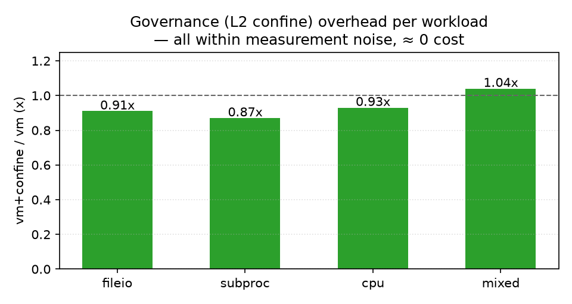
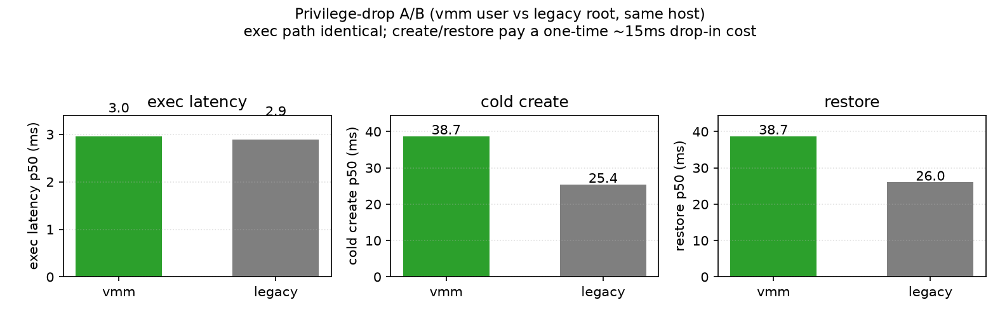

# 性能：为什么 Terrarium 适合做 agent 运行时

> 结论先行：**治理（L2 confine）零开销**，VM 硬隔离在计算密集路径
> ~1.3-2×，而 agent 真正高频的 exec 路径比 docker exec 快 ~30×、比
> gVisor 一次性沙箱快 ~100×。把 CH/virtiofsd 降权到专用用户后，exec
> 路径零回退，冷启动（create/restore）一次性多 ~15ms。

## 1. exec 路径：agent 的真实主成本

Agent 一天做几千上万次工具调用，**每次调用的固定开销**才是真实场景
的主成本。2026-08-15 实测（p50，同宿主）：

| 执行方式 | 单次延迟 | 相对 Terrarium |
|---|---:|---:|
| Terrarium（warm VM，vsock 通道） | **2.9 ms** | 1× |
| docker exec（长驻容器） | 88.9 ms | ~31× |
| gVisor runsc do（一次性沙箱，含启动） | 293.3 ms | ~101× |

原因：Terrarium 的 VM 是长驻的，agent 复用一个 vsock 通道，单次调用
就是一次 socket 往返（~3ms）；docker exec 每次走 CLI/runc 往返
（~90ms）；gVisor `do` 每次建一个沙箱（~300ms）。对 RL 训练和 agent
执行场景，这个差距直接变成训练吞吐或任务时长的倍数。

## 2. 真实负载开销：治理 ≈ 0，隔离是负载依赖的

同一个静态 C 探针在五种环境跑同样负载（5 次取中位数），原始数据
[workload-overhead-2026-08-15-vmm.json](workload-overhead-2026-08-15-vmm.json)：

| 负载 | bare | vm | vm+confine | docker(exec) | gvisor(do) | 治理(vm+c/vm) |
|---|---:|---:|---:|---:|---:|---:|
| fileio | 36.9 | 17.0 | 15.5 | 136.3 | 619.9 | 0.91× |
| subproc | 147.3 | 140.8 | 122.2 | 172.2 | 1094.7 | 0.87× |
| cpu | 8.2 | 10.9 | 10.1 | 98.9 | 286.9 | 0.93× |
| mixed | 32.0 | 36.2 | 37.5 | 117.1 | 564.7 | 1.04× |

解读：

1. **治理（L2 confine）≈ 0 开销**：Landlock 是内核静态裁决（零逐调用
   开销）、seccomp 只拦低频网络 syscall、cgroup 是配额被动记账。把
   L2 设计成"行为约束"而不是"syscall 拦截器"，治理就不是性能税。
2. **VM 边界（L1）是负载依赖的**：纯 CPU ~1.3-2×（1 vCPU guest）；
   文件/进程/混合负载 ~0.5-1.3×（guest /tmp 是 tmpfs，fileio 反而
   比宿主磁盘快）。agent 的工作（改代码、跑构建、读文件）基本持平。
3. **对比基线**：同样的活，docker exec 慢 4-12×、gVisor 一次性沙箱
   慢 15-40×——隔离强度换来的固定成本全在启动路径上，不在稳态执行里。

## 3. 降权（vmm 用户）对性能的影响

把 CH/virtiofsd 从 root 降为专用 `terra-vmm` 用户（fd 传递 tap、导出
树 chown、uid 翻译）后，同机 A/B（原始数据
[bench-privilege-drop-2026-08-15.json](bench-privilege-drop-2026-08-15.json)，
顺序交换验证 [swap](bench-privilege-drop-swap-2026-08-15.json)）：

| 指标 | vmm（降权） | legacy（root） | 差异 |
|---|---:|---:|---:|
| exec 延迟 p50 | 2.96 ms | 2.89 ms | ~0 |
| exec 吞吐（16 并发） | 721 execs/s | 723 execs/s | ~0 |
| cold create p50 | 38.7 ms | 25.4 ms | +13 ms（~0.6×） |
| restore p50 | 38.7 ms | 26.0 ms | +13 ms（~0.6×） |

create/restore 的差异来自 virtiofsd/CH 以非 root 启动的一次性初始化
（~7ms，实测组件级）加上 5ms 轮询的离散放大；exec 高频路径零回退。
这是安全属性（guest 逃逸不再直接是宿主 root）换取的、每 VM 一次性的
成本，与 agent 稳态运行无关。

## 4. 密度：VM 隔离，容器级内存成本

2026-08-15 同宿主 100 个长驻实例扫描。Terrarium 有两条创建路径：
冷启动（完整 VM boot，~9/s）和**快照恢复**（P1 快速重置，RL/密度场景
的主路径）。下表用快照路径（原始数据
[density-compare-snapshot-2026-08-15.json](density-compare-snapshot-2026-08-15.json)，
冷启动对照 [density-compare-2026-08-15.json](density-compare-2026-08-15.json)）：

| 指标 | Terrarium | docker | gVisor |
|---|---:|---:|---:|
| 创建速率（instances/s） | **59.24**（快照；冷启动 9.07） | 3.17 | 35.34* |
| 宿主内存/实例（MB） | 61.6 | 0.6† | 85.8 |
| 聚合 exec 吞吐（execs/s） | 1787 | 165.2 | n/a |

\* gVisor 的 `runsc do` 是空壳一次性沙箱（无预置环境），但即便如此
快照恢复仍比它快 1.7×；冷启动慢是公平的——Terrarium 冷启动要给每个
租户 boot 完整 VM（kernel + 层文件系统 + guest agent + 网络），gVisor
空壳没有这些。† docker 的 0.6 MB 是共享内核的容器壳，隔离由宿主内核
承担，不是可比对象。

**层共享**：同一份只读层页缓存在所有 VM 间共享——12 个租户时
per-VM Pss 稳定在 ~52 MB（RSS 63-65 MB 中约 17-21% 是共享页），99 MB
的 ubuntu 层只比 20 MB 的 base 多 ~2 MB/VM（原始数据
`benchmark-results-2026-08-03-*.json`）：

快照恢复 ~26 ms（legacy）/ ~39 ms（vmm）p50，热池 claim ~9 ms、
零内核操作；批量编排 `batch_create` 16 环境 753 ms（详见
[benchmarks.md](benchmarks.md)）。

## 5. 诚实局限

- 单宿主、单日采样；cpu 负载受宿主并发影响（报告多次采样中位数）。
- gVisor 的一次性 `do` 含启动成本，不是长驻 gVisor 的稳态对比；docker
  是 `exec`（长驻容器），是 docker 的稳态路径。
- 降权 A/B 的 create/restore 差异含轮询离散，绝对值随宿主抖动，但
  两模式均按同一方法测得。
- 可复现：`docs/scripts/plot_performance.py` 重新出图；基准脚本在
  `sdk/python/tests/`（`workload_overhead.py`、`bench_privilege_drop.py`）。
